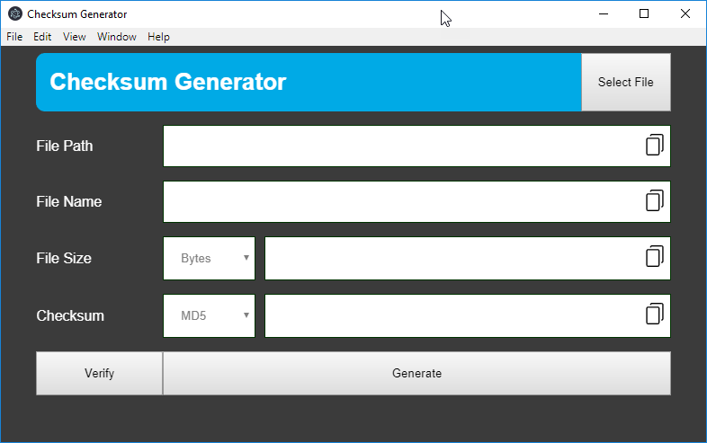

# 1. electron-js-hash-generator

- [1. electron-js-hash-generator](#1-electron-js-hash-generator)
  - [1.1. Purpose](#11-purpose)
  - [1.2. Screenshot(s)](#12-screenshots)
  - [1.3. Features](#13-features)
  - [1.4. Getting Started](#14-getting-started)

---

## 1.1. Purpose

Electron JS application to calculate `Checksum` and `File size` of a file.

## 1.2. Screenshot(s)



## 1.3. Features

1. Calculate hash by selecting a file from Dialog or by Dragging and Dropping the file on the window.
2. Enter Checksum of manually and validate the checksum value.
3. Convert the filesize into:
   - Bytes
   - Kilo Bytes
   - Mega Bytes
   - Giga Bytes

## 1.4. Getting Started

- Clone the repository
- Navigate to the Folder
- Install packages
- Run Application

```bash
git clone https://github.com/fahidnasir/electron-js-hash-generator.git
cd electron-js-hash-generator
yarn
yarn start
```
